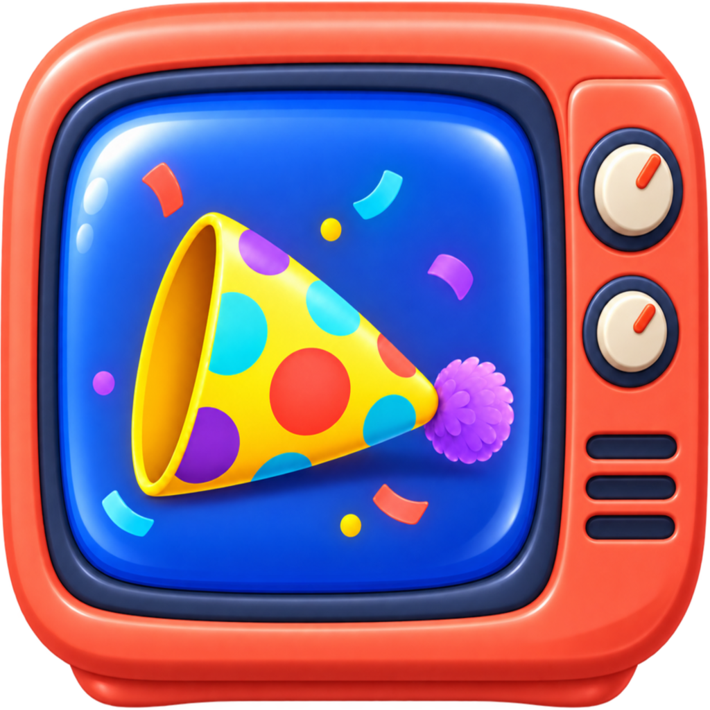
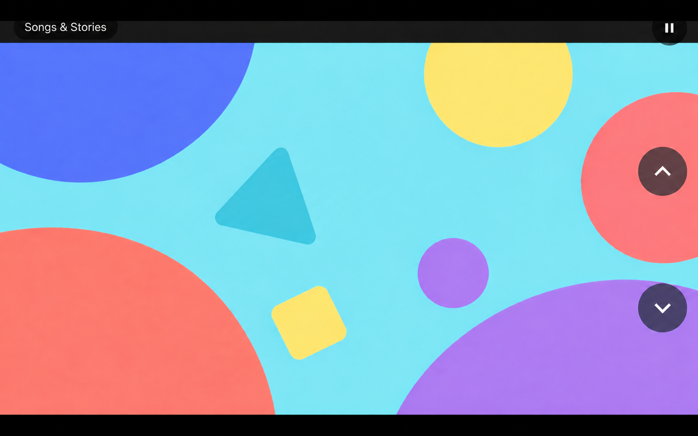

<p align="center">
  
</p>

# The Kids Channel

The Kids Channel turns a phone or tablet into a simple video player for
children. There is no timeline, seeking, playlist editing, or next-video
button. Videos play in order, loop continuously, and resume where they left
off.



## Download and install

The Kids Channel requires Android 8.0 or newer.

1. Open the [latest release](https://github.com/dlip/the-kids-channel/releases/latest).
2. Under **Assets**, download the file ending in `.apk`.
3. Open the downloaded APK on your phone or tablet.
4. If Android blocks the installation, allow your browser or file manager to
   install unknown apps, then try again.

Future versions can be installed over the current app without removing its
folders or saved playback positions.

## Set up channels

1. Open the app and tap **Add root folder**.
2. Select a folder containing one subfolder for each channel.
3. Tap the up and down arrows to change channels.

For example:

```text
Kids Videos/
├── Songs/
│   ├── 01 Hello.mp4
│   └── More Songs/
│       └── 02 Goodbye.mp4
└── Stories/
    ├── 01 The Bear.mp4
    └── 02 The Moon.mp4
```

`Songs` and `Stories` are channels. Nested folders such as `More Songs` remain
part of their parent channel. Videos are played in natural filename order, so
number prefixes can be used to control their order.

## Controls

- Tap the screen to show the controls. They fade away after five seconds.
- Tap the pause button to pause or resume playback.
- Hold the pause button for 5 seconds to open Settings.
- Tap the up or down arrow to change channels.

The app remembers the current video and playback position separately for each
channel. When it reaches the end of a channel, it starts again from the
beginning.

Developer setup, building, deployment, and release instructions are in
[DEVELOPMENT.md](DEVELOPMENT.md).
